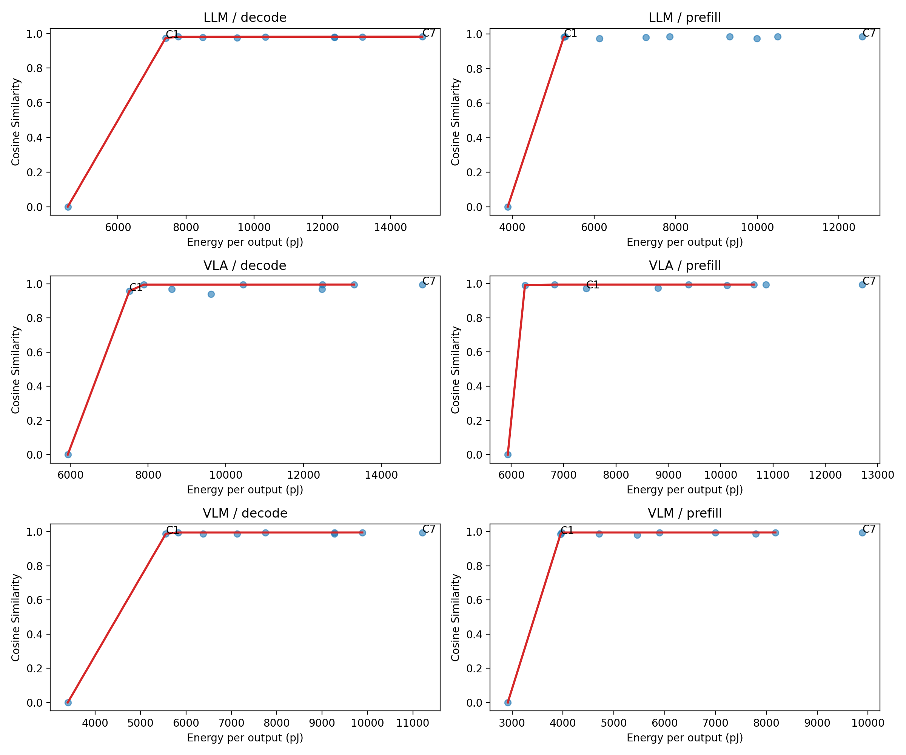
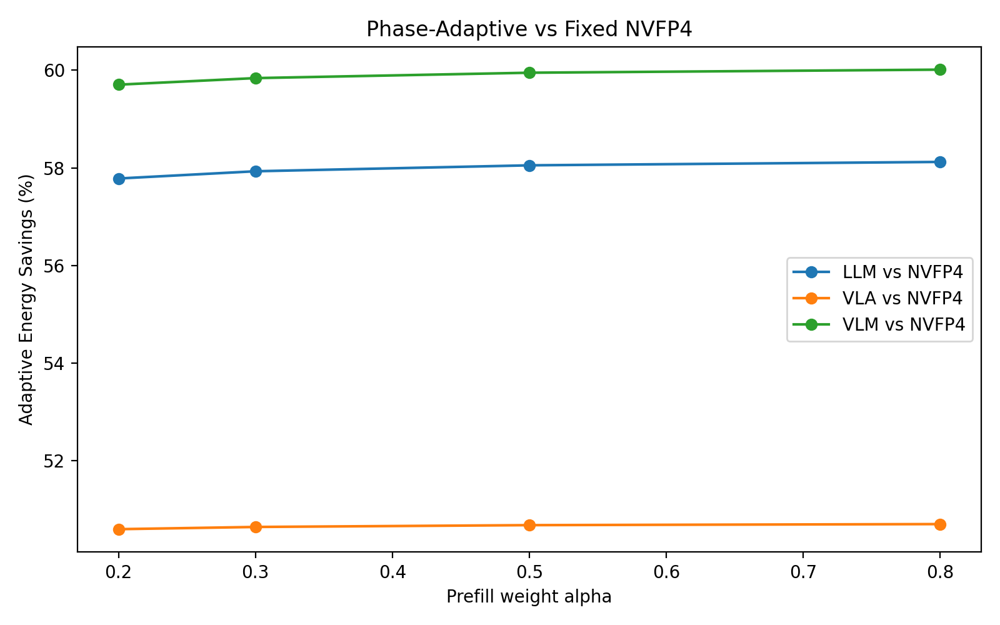
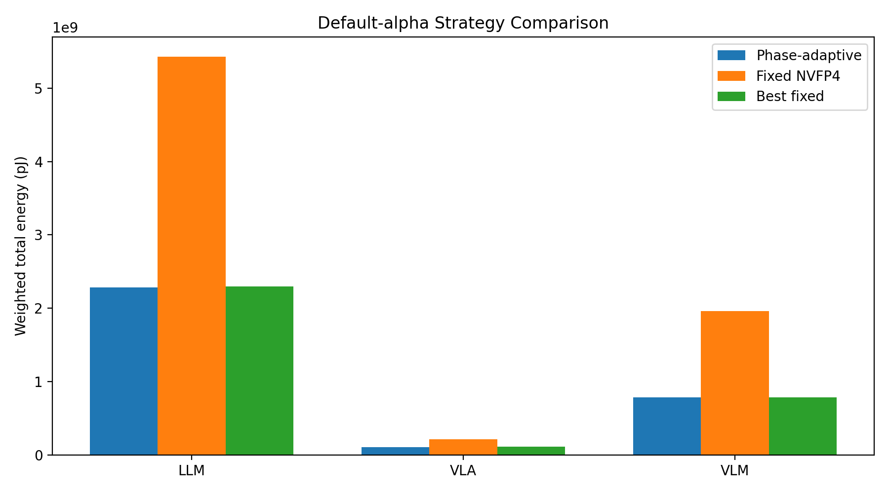

<!-- _class: cover -->

MIT Deep Learning Hardware Report

# Phase-Adaptive Quantization

### Design space exploration of 4-bit MMA rescale pipelines

Yichong Zhang and Wenye Xiong  
Hardware-aware quantization for custom AI inference accelerators

---

## One-Line Thesis

**A single 4-bit quantization pipeline is not globally optimal.**

Modern inference has two very different phases:

- **Prefill:** large-$M$ forward pass, compute-bound, rescale arithmetic is expensive.
- **Decode:** $M=1$ autoregressive generation, memory-bandwidth-bound, 4-bit weight movement helps.

Our search shows that the best datapath changes across workload and phase: C1, C8, and C9 are each selected somewhere under a 0.98 cosine-similarity floor.

---

## Motivation: Same Format, Opposite Behavior

NVFP4 is optimized for general GPUs, but it bundles a fixed datapath:

2 rescale levels
b=16 + tensor scale
FP32 rescale
FP32 accumulation

That conservative pipeline is safe, but not always energy efficient for a known deployment target.

/figures/energy_breakdown.png)

---

## Preliminary Bottleneck Result

| Phase | NVFP4 energy vs FP16 | NVFP4 latency vs FP16 | Rescale share | Interpretation |
|---|---:|---:|---:|---|
| Decode, $M=1$ | **0.90x** | **0.59x** | 64.5% | Bandwidth savings outweigh rescale cost |
| Prefill, $M=128$ | **1.27x** | **0.29x** | 74.0% | Rescale turns W4A4 energy-negative |

The same NVFP4-like pipeline helps decode energy but hurts prefill energy. That asymmetry is the reason to search phase-specific datapaths.

---

## Core Research Question

Can we decompose a 4-bit MMA rescale pipeline into hardware-realizable design dimensions and show that **prefill and decode have different Pareto-optimal configurations**?

The design space varies:

- **Pipeline structure:** 0, 1, or 2 rescale levels; block sizes such as 16 or 32.
- **Scale format:** FP32, FP16, or E8M0 power-of-two shifts.
- **Accumulator precision:** FP32 or FP16.
- **Workload shape:** LLM FFN, VLM vision GEMM, VLA action head.

---

## Search Space: Existing Formats Become Points

| Config | Role | Topology | Scale path | Accumulator |
|---|---|---|---|---|
| C0 | Ideal lower bound | raw FP4 | none | FP32 |
| **C1** | MXFP4-like | 1-level, b=32 | E8M0 shift | FP32 |
| C3/C4 | One-level baselines | 1-level, b=16 | FP16 / FP32 | FP32 |
| **C7** | NVFP4-like reference | 2-level, b=16 + tensor | FP32 + FP32 | FP32 |
| **C8** | Aggressive one-level | 1-level, b=16 | FP16 | FP16 |
| **C9** | Aggressive hybrid | 2-level, b=16 + tensor | E8M0 + FP16 | FP16 |

Existing schemes are not separate categories; they are fixed coordinates inside the same DSE.

---

## What `run_sweeps.py` Automates

<strong>Manifest</strong>10 configs x 3 workloads x 2 phases

<strong>Workload YAML</strong>Generate AccelForge einsum graphs for each datapath

<strong>Arch YAML</strong>Parametric PE array, memory, QuantMAC, FP4MAC, RescaleMAC

<strong>Hardware</strong>Run or resume AccelForge mappings; record energy, latency, area

<strong>Accuracy</strong>Pure-Python emulator computes cosine vs FP16 snapshots

The proposal path models inference-time execution: weights are prequantized offline, while runtime activation quantization, FP4 matmul, and output rescale remain in the graph.

---

## Experiment Setup

| Workload | Representative shape | Phase model | Accuracy proxy |
|---|---:|---|---|
| LLM FFN | $(M, 11008, 4096)$ | Decode $M=1$, prefill $M=128$ | Layer-output cosine |
| VLM vision | $(M, 3072, 3072)$ | Decode $M=1$, prefill $M=128$ | Layer-output cosine |
| VLA action head | $(M, 256, 4096)$ | Decode $M=1$, prefill $M=128$ | Layer-output cosine |

Hardware model: parameterized 8x8 PE-array accelerator, 64 KB GLB, 128 B RF/PE, 45 nm component assumptions.

Completed run status: **60 hardware rows + 60 accuracy rows, all OK**.

---

## Result 1: Best Configurations Differ

Under cosine similarity $\ge 0.98$:

| Workload | Decode best | Decode energy / output | Prefill best | Prefill energy / output |
|---|---|---:|---|---:|
| LLM | **C8** | 7,767 pJ | **C1** | 5,262 pJ |
| VLM | **C1** | 5,557 pJ | **C1** | 3,952 pJ |
| VLA | **C8** | 7,891 pJ | **C9** | 6,263 pJ |

No single configuration wins all six workload-phase cells. VLM collapses to one simple mode; LLM and VLA benefit from phase-specific choices.

---

## Result 2: Pareto Frontiers Shift by Workload and Phase

Each panel plots energy per output against cosine similarity. C7 is NVFP4-like; C1 is MXFP4-like.

---

## Result 3: Phase-Adaptive Beats Fixed NVFP4-like C7

Across deployment weights $\alpha$:

- **LLM:** about 58% lower weighted energy vs C7.
- **VLM:** about 60% lower weighted energy vs C7.
- **VLA:** about 51% lower weighted energy vs C7.

Relative to best-fixed, phase adaptation is selective:

- LLM: about 0.6%
- VLM: 0%
- VLA: about 8.2%

---

## Strategy Comparison at Default $\alpha$

Phase-adaptive equals best-fixed for VLM because both phases select C1.

---

## Interpretation

C1

MXFP4-like

Often the low-energy knee. Selected for LLM prefill and both VLM phases.

C8

FP16 rescale + FP16 acc

Spends a little more energy to clear accuracy in LLM/VLA decode.

C9

Hybrid two-level

Wins VLA prefill, where a small action-head output dimension changes the tradeoff.

The main contribution is not one universal format; it is the workload- and phase-aware search methodology.

---

## Contributions

1. **Structured search space** for 4-bit MMA rescale pipelines with hardware-realizable datapaths.
2. **Phase-aware evaluation** that separates prefill and decode instead of averaging them away.
3. **Reproducible sweep tooling** that generates AccelForge inputs, runs hardware cost models, emulates accuracy, and joins results.
4. **Completed evidence** that C7/NVFP4-like is consistently high energy, while the optimal choice depends on workload and phase.

---

## Limitations and Next Steps

Current limitations:

- Accuracy uses layer-output cosine on bounded tensor slices, not full end-to-end task metrics.
- AccelForge modeling uses analytical component assumptions rather than synthesized RTL.
- Phase switching overhead is discussed qualitatively; implementation cost needs a tighter area and control estimate.

Next work:

- Larger tensor slices and end-to-end perplexity / task accuracy / success-rate evaluation.
- Milestone-3 architecture saturation analysis across QuantMAC and RescaleMAC counts.
- Final write-up polish and a clearer recommendation for when to enable phase adaptation.

---

## Closing Takeaway

**General-purpose 4-bit formats bundle too many choices.**

When the accelerator target is known, those choices should be searched:

50-60%

Energy reduction vs NVFP4-like C7

3

Distinct selected datapaths

60 + 60

Completed hardware and accuracy rows

Phase-adaptive quantization is useful precisely because it can also tell us when not to adapt.
